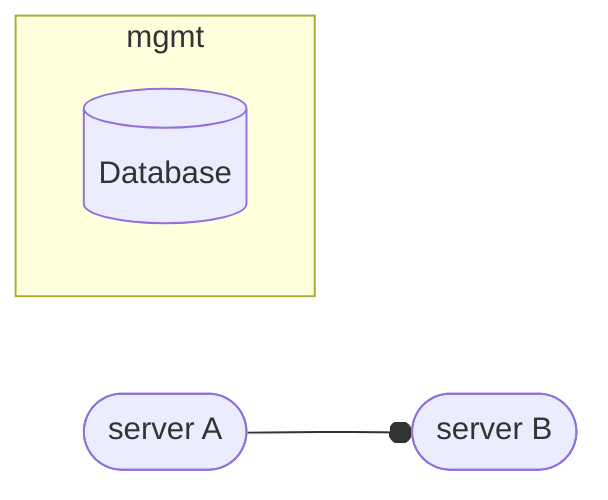
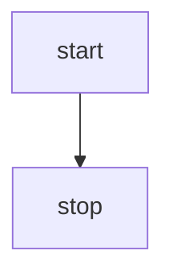
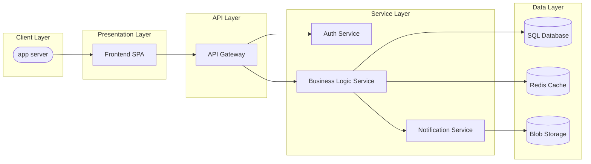

```mermaid    
flowchart LR
    id1([server A])
    id2([server B])

    id1--oid2
    

    subgraph mgmt
   
        id3[(Database)]
    end
    
```

```mermaid
graph TB
    start --> stop

```

```mermaid
flowchart LR
    subgraph Client Layer
        A([app server])
    end
   subgraph Presentation Layer
        B[Frontend SPA]
    end
    subgraph API Layer
        C[API Gateway]
    end
    subgraph Service Layer
        D[Auth Service]
        E[Business Logic Service]
        F[Notification Service]
    end
    subgraph Data Layer
        G[(SQL Database)]
        H[(Redis Cache)]
        I[(Blob Storage)]
    end
    A --> B --> C
    C --> D
    C --> E
    E --> F
    E --> G
    E --> H
    F --> I
```