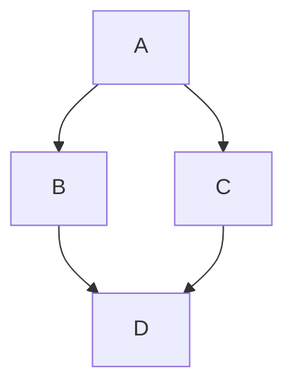
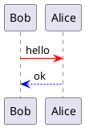
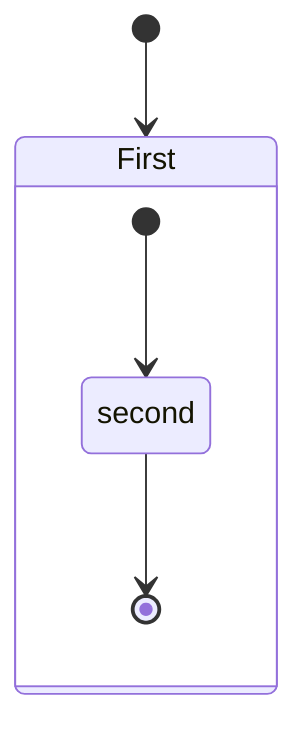
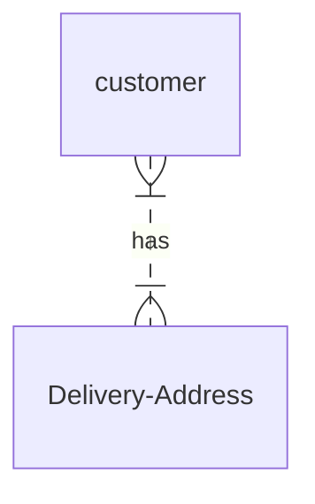

# hello
## This is my first markdown

**Good way of writing documents**

> This is blockquote

*this is italics*
1. First item
2. Second item
3. Third item

```
{
  "firstName": "John",
  "lastName": "Smith",
  "age": 25
}
```



| code  | color                                           |
| :---- |:------------------------------------------------|
| #0F0  | <span style="color:rgb(0,200,0)">&#9724;</span> |
| #F00  | <span style="color:rgb(200,0,0)">&#9724;</span> |

```sequence
Alice->Blob
```









```mermaid
architecture-beta
service db(database)[Database] in db_rg
```


- [ ] cdcld 
